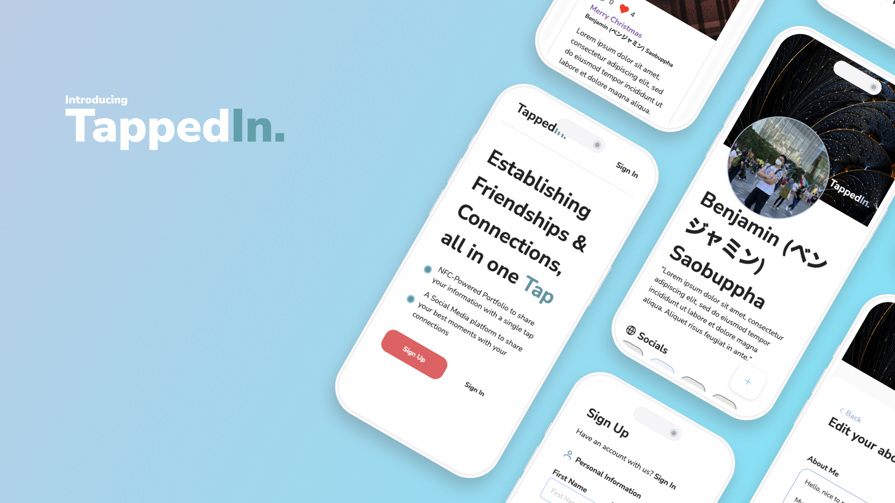

# **TappedIn**




Meet **TappedIn**! 📱

An all-in-one application to share a snapshot of yourself and socialize, all with one tap of your phone! We're an NFC-capable application that combine features of networking & socialization platform into one.

## **Motivation**

TappedIn's initiative is to connect people together and build communities, through ease of socialization. We want to make information sharing and networking as seamless as possible. Instead of pulling out your phone and sharing every one of your social media platform, we've combined all this into your one public profile, with extra features!

## **Installation**

### **Prerequisite**

- Node

### **Running the App**

First, you'll need to start up the backend and frontend.

```bash
# Start the backend
$ cd tappedin-api/
$ npm i
$ npm run dev

# Start the frontend
$ cd ../tappedin-app/
$ npm i
$ npm run dev
```

Then you can now visit.,

```none
http://localhost:3000/
```
