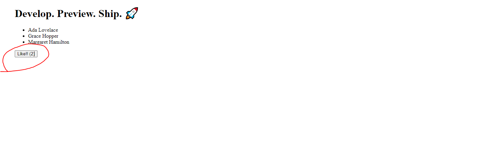

# Setup Process

## Setting up the Front End [tappedin-app] (React + Next.js)
    - Initialized the react app using next.js framework
    - Added a live server watcher using nodemon
    - Added basic linting and code formatting using eslint + prettier
    - Setup basic dependencies and scripts in package.json (npm)
    - Setup basic POST request to add item to DB

## Setting up the Back End [tappedin-api] (express.js + node.js)
    - Initialized express server using express-generator
    - Configured server with ES6 standard using Babel compiler
    - Automatic code watch using nodemon
    - Configured start up process in package.json scripts
    - Added basic linting and code formatting using eslint + prettier
    - Set up basic dependencies using npm
    - Setup some environment variables
    - Setup basic DB connection and handled call from front to add connection to DB
    - Setup basic CORS policy to allow frontend to connect to backend

## Setting up the DB (mongodb)
    - Setup DB using mongodb (created account + cluster)
    - Configured server credentials and initial IP addresses
    - Allowed backend to add sample data to DB

## Basic Connection Test

Button on front end sends a POST request to the back end, the backend then sets up a connection with 
MongoDB and adds a short message along with the time that it happened.

### Button from the front end:

### Back end receiving the request:

### DB entry populated:
