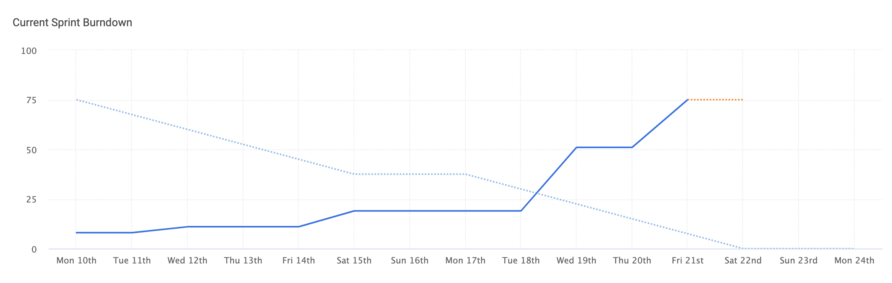

# Burndown

## Trello Link
https://trello.com/invite/b/RMq8moHa/ATTIad61a4294b1d75329ff9e57441c953425D651254/tappedin

## Burndown Chart

The actual burndown (blue line) does not climb much in the beginning, but climbs steeply near the end. Not many tickets are started early on, and any work done is usually setup/templates, which is why there is not much movement. But near the end when visible features start getting implemented, there is a steep climb.

## Velocity
Velocity wise, we doubled the amount of story points we completed (31 -> 75), this is probably because we have gotten through the setup and planning stage and have a clearer vision of what we want to accomplish, thus giving us more confidence to complete bigger tickets. Another factor is we are more familiar with our tech stack, allowing us to complete more/bigger tickets.