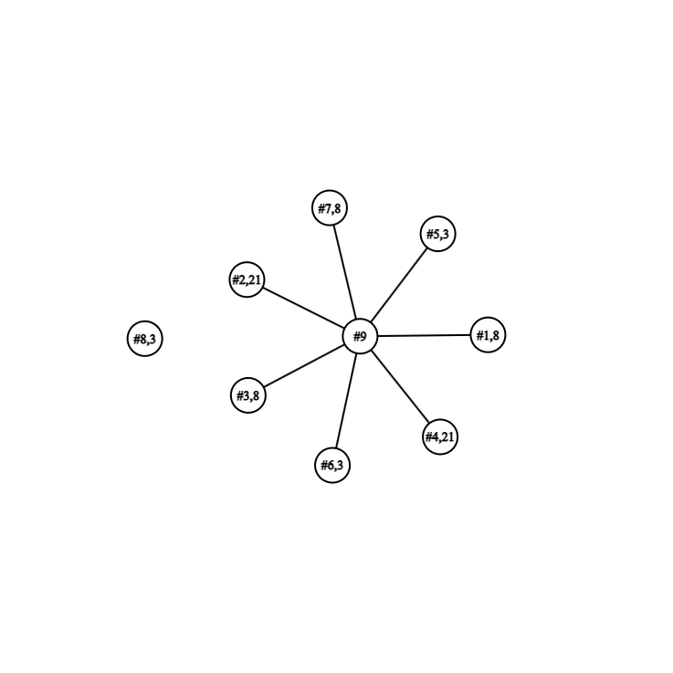

# Schedule

## Network Diagram

| Task ID | Story Points | Dependencies |
| ------- | ------------ | ------------ |
| #1      | 8 | N/A |
| #2      | 21 | N/A |
| #3     | 8 | N/A |
| #4      | 21 | N/A |
| #5      | 3 | N/A |
| #6      | 3 | N/A |
| #7     | 8 | N/A |
| #8      | 3 | N/A |
| #9 (Dashboard)      | 8 | N/A |

## Critical Path

The only this part of the critical path is #9, the dashboard. Since all the stories worked on this sprint relate to editing items on the dashboard, thus only the base dashboard needs to be done before everything else can be created.

## Keeping the Sprint in schedule

To keep the sprint in schedule as a team we make sure to complete items within the critical path first (in this case the dashboard), once it is done everyone else can work on their tasks on their own time. Apart from that we communicate with our team when we push some code that may help someone else or is similar to what someone else is doing. So that person can save time implementing a feature/not rewriting code.
