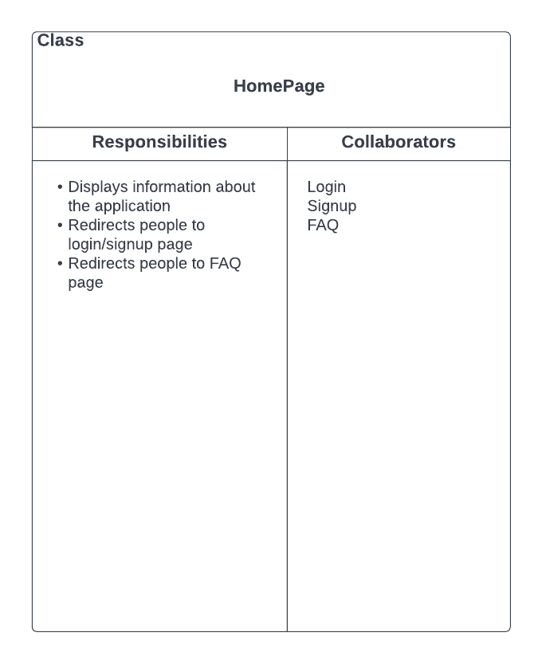

# TappedIn - System Design Document

 
 
 
 
 
 
 

# Table of Contents

1. [System Design](#sysdes)
   1. [External Interaction with the Application](#sysdes1)
   2. [Application Architecture](#sysdes2)
   3. [Backend Structure](#sysdes3)
   4. [Exception Handling](#sysdes4)
2. [CRC Cards](#crc)

 
 
 
 
 
 
 

# System Design

## External Interaction with the Application
### Overall view on how external components will interact with the application.

---

## Application Architecture

### High Level view on how the application will be structured

We are using three-tiered design, so there is a presentation layer (tappedin-app), the logic layer (tappedin-api), and then the data layer (MongoDB). 

tappedin-app (frontend) will display all of the necessary information to the user and allow the user to interact with the application. tappedin-app will use REST to send API calls to tappedin-api in order to retrieve/send information, or to required operations. 

tappedin-api (backend) will perform operations required by tappedin-app by either performing operations on the server (ex. retrieving and parsing third-party API calls) or by performing CRUD operations on the DB.

The database chosen for this project is MongoDB, it will store all of the information needed for the application such as user info, application content, etc.

tappedin-app will authenticate users using the Firebase Authentication provided by Google. This will allow the app to control what information each user can see. This will also block users who are not signed in from accessing certain pages.

---

## Backend Structure
### High Level, early view on how the server will be designed

The server (app.js) will configure the endpoints and route request to its applicable function, which will utilize some service to complete its request. 

Each service is an interface with some set of related operations (ex. getUserInfo(), createNewUser(), changeUserPassword(), ... ). Each request can be routed to these services, and these functions call be called to perform the requested operations. Although there are 4 services listed, there may need to be more as the number of features increase. 

Everything that needs to perform DB operations must go through the DBAccessService, which performs operations on the DB.

This design of using interfaces allows for separation of concern and   dependency injection.

---

## Exception Handling
A general flow for exception handling:
- Error caught in frontend, handle it and notify user if necessary.
- Error caught in backend, send applicable status code (400, 500), handle in frontend and notify user if necessary.
- Ideally validation (valid username, etc) should happen at least at the backend
- Errors in accessing the DB will be caught by the backend, and a corresponding error will be sent to the frontend.
- Errors that impacts user experience should notify the user in someway
- If an error is caught, the operation **should not** be performed. i.e if some step of creating a new user fails, the DB should not have a new entry.

---

# CRC Cards
## Backend

---

---

## Frontend

---

